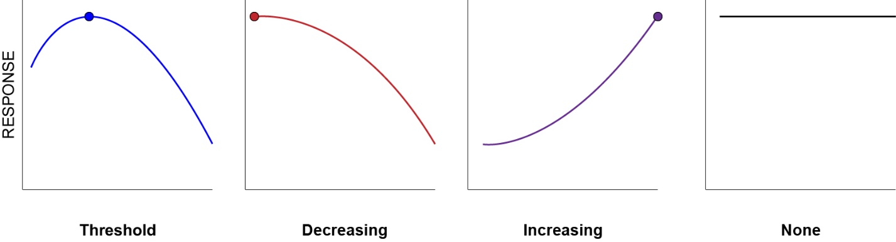

```{r setup-options, include=FALSE}
knitr::opts_chunk$set(echo = FALSE)
options(knitr.kable.NA = '')
```

```{r load-csv, include=FALSE}
# x <- read.csv('path/to/file.csv', strip.white=TRUE)
```

```{r setup-functions, include=FALSE}
### set graphical parameters
`set_par` <- function (panels = 1, pty = 's', ...) {
    mgp <- c(2, 0.4, 0)
    mar <- c(4, 4, 0.5, 0.5)
    oma <- c(0, 0, 0, 0)
    auto_rowcol <- function(n = panels) {
        if (n <= 3) 
            c(1, n)
        else if (n <= 6) 
            c(2, (n + 1)%/%2)
        else if (n <= 12) 
            c(3, (n + 2)%/%3)
        else c(ceiling(n/(nr <- ceiling(sqrt(n)))), nr)
    }
    mfrow <- auto_rowcol()
    if (panels > 4) 
        panels <- 4
    switch(as.character(panels), `4` = par(mfrow = mfrow, 
        mgp = mgp, mar = mar, pty = pty, oma = oma, bty = 'L', 
        las = 1, cex.lab = 1.2, tcl = -0.2, ...), `3` = par(mfrow = mfrow, 
        mgp = mgp, mar = mar, pty = pty, oma = oma, bty = 'L', 
        las = 1, cex.lab = 1.4, cex.axis = 1.2, tcl = -0.2, ...), 
        `2` = par(mfrow = mfrow, mgp = mgp, mar = mar, 
            pty = pty, oma = oma, bty = 'L', las = 1, cex.axis = 0.85, 
            tcl = -0.2, ...), `1` = par(mfrow = mfrow, 
            mgp = mgp, mar = mar, pty = pty, oma = oma, bty = 'L', 
            las = 1, cex.axis = 0.85, tcl = -0.2, ...))
}
# ### get some value
# `get_n` <- function (pick, ...) {
#         n <- x[x$pid==pick, 'n_plots']
#         if (any(!is.finite(n))) c(NA) else n
# }
# ### table function with 5-y mean
# `get_tab` <- function (pick, xvar, col.names, caption, format){
#         tab <- x[which(x$pid==pick), xvar]
#         if (missing(col.names)) col.names <- xvar
#         if (missing(caption))   caption   <- NULL
#         if (missing(format))    format    <- 'pandoc'
#         j   <- xvar[xvar != 'tenyr'] # dont consider year column
#         tab <- tab[rowSums(is.na(tab[,j])) != ncol(tab[,j]),]
#         tab[tab %in% c('NA','***NA***','NaN','***NaN***')] <- NA 
#         knitr::kable(x         = tab,
#                      format    = format,
#                      row.names = F,
#                      align = c('l', rep('r',NCOL(tab)-1)),
#                      longtable = T,
#                      booktabs  = T,
#                      caption   = caption,
#                      col.names = col.names)
# }
```

\newpage

# Motivation

A critical load (CL) is the atmospheric deposition level expected to result in harmful ecosystem changes.  Exceedance is the amount by which local deposition goes beyond an established CL.  

# Summary

## Estimated deposition range for `r params$unit`

Minimum total N deposition: `zzz` kg ha^-1^ y^-1^  
Maximum total N deposition: `zzz` kg ha^-1^ y^-1^  

## Short summary of critical loads

Alpine minimum: \tab  `zzz`  
Alpine maximum: \tab `zzz`  
Herb richness minimum: \tab `zzz`  
Herb richness maximum: \tab `zzz`  
Herb richness 10\% decline: \tab `zzz`  
Herb richness median: \tab `zzz`  
Tree growth minimum: \tab `zzz`  
Tree growth median: \tab `zzz`  
Tree survival minimum: \tab `zzz`  
Tree survival median: \tab `zzz`  
Lichen minimum: \tab `zzz`  
Lichen maximum: \tab `zzz`  
Mycorrhizal fungi minimum: \tab `zzz`  
Mycorrhizal fungi maximum: \tab `zzz`  
Nitrate Leaching minimum: \tab `zzz`  
Nitrate Leaching maximum: \tab `zzz`  
Aquatic minimum: \tab `zzz`  
Aquatic maximum: \tab `zzz`  

\newpage

## Extended summary of critical loads

```{r critical_loads_tab_02}
tab <- data.frame(Metric = c('Species richness',
                             'Sensitive species richness',
                             'Forage lichen abundance',
                             'Cyanolichen abundance',
                             'Comm composition shifts'),
                  Ndep = c(3.5, 3.1, 1.9, 1.3, 1.5),
                  Sdep = c(6.0, 2.5, 2.6, 2.3, 2.7))

tab_02 <- read.csv('./tab_02_extended.csv')
knitr::kable(tab_02, 
             format='pandoc', 
             row.names = F, 
             longtable = T,
             booktabs  = T,
             caption   = 'Extended summary of critical loads. Critical loads given as (kg ha^-1^ y^-1^).',
             escape    = F,
             col.names = c(
               'Ecosystem component','Source','Name','Critical load (kg N ha^-1^ y^-1^)')
             )
```


\newpage

<!-- ####    ####    ####    ####    ####    ####    ####    ####    #### -->
<!-- ####    ####    ####    ####    ####    ####    ####    ####    #### -->
<!-- ####    ####    ####    ####    ####    ####    ####    ####    #### -->


# Deposition from TDep

**Citation:** Schwede and Lear (2014)  

**Description:** Deposition of N-containing compounds was modeled with the National Atmospheric Deposition Program Total Deposition Model (TDep).  Total N incorporates both wet and dry deposition of oxidized (NO~x~, HNO~3~) and reduced N species (NH~x~). To smooth year-to-year variation, we report mean annual deposition for the three-year period 2015-2017.  

**Cell size:** 4134 m  

**Most recent data:** 2017-2019  

**Uncertainty:** A weighted deposition uncertainty metric (WDUM) helps scientists and decision-makers assess CL exceedances (Walker et al. 2019). The WDUM applied to National Atmospheric Deposition Program (NADP) Total Deposition (TDep) estimates shows greater uncertainty where dry deposition makes a larger contribution to the deposition budget, particularly ammonia (NH~3~) in agricultural areas and oxidized nitrogen (NO~x~) in urban areas.  Organic N deposition is an important source of uncertainty over much of the US.  The WDUM can help assess spatial patterns of deposition uncertainty and inform CL assessments at the local scale.  

| Type | Min | Med | Max |
| ---- | ---- | ---- | ---- |
| Total N deposition | `zzz` | `zzz` | `zzz` |
| Percent wet N deposition | `zzz` | `zzz` | `zzz` |
| Percent oxidized N | `zzz` | `zzz` | `zzz` |

Table: TDep total deposition.

*TODO: map of TDep with land unit boundary*

*TODO: plot trend of Min/Med/Max*


\newpage

<!-- ####    ####    ####    ####    ####    ####    ####    ####    #### -->
<!-- ####    ####    ####    ####    ####    ####    ####    ####    #### -->
<!-- ####    ####    ####    ####    ####    ####    ####    ####    #### -->


# Alpine vegetation

**Citation:** Bowman et al. (2012)  

**Description:** Researchers fertilized alpine vegetation with increasing levels of N to determine the level of deposition that changed community compositions.  Plots were located in multiple sites on the eastern edge of the Rocky Mountains of Colorado.  Models calculated a 2.5\% increase in *Carex rupestris* cover per year at 3.0 kg N ha^-1^ y^-1^, and increases in NO~3~ leaching below the rooting zone at 10.0 kg N ha^-1^ y^-1^.  

**Response:** Response curves were not calculated.  

**Notes:** This CL is specific to alpine meadow habitats, but is applied more broadly due to lack of additional data and because alpine vegetation occurs in a range of habitats above treeline. The sedge species in the N-fertilization experiment occurs across the Rocky Mountains but not elsewhere. The CL is extrapolated because similar CLs exist in harsh, low-nutrient ecosystems.  

**Critical load of N for an increase in alpine sedge growth:** 3.0 kg N ha^-1^ y^-1^  

**Critical load of N for an increase in soil N leaching:** 10.0 kg N ha^-1^ y^-1^  

**Data type:** surface  

**Cell size:** 30 m  

**Most recent data:** xxxx-xxxx  

**Data description:** The critical loads are applied to all areas above sea level within each land unit because national datasets were inconsistent in identifying vegetated areas relative to local surveys (McClung et al. 2021). The alpine dataset is extracted from the USGS Gap Analysis Project.  

| Type | Alpine area (km^2^) | Area < CL (km^2^) | Area at CL (km^2^) | Area > CL (km^2^) |
| ---- | ---- | ---- | ---- | ---- |
| Increased sedge growth | `zzz` | `zzz` | `zzz` | `zzz` |
| Increased NO~3~ leaching | `zzz` | `zzz` | `zzz` | `zzz` |  

Table: Surface exceedances (alpine critical loads).


\newpage

<!-- ####    ####    ####    ####    ####    ####    ####    ####    #### -->
<!-- ####    ####    ####    ####    ####    ####    ####    ####    #### -->
<!-- ####    ####    ####    ####    ####    ####    ####    ####    #### -->


# Herbaceous plant species richness

**Citation:** Simkin et al. (2016)  

**Description:** This analysis used 15,136 herbaceous vegetation survey plots to evaluate how plant species richness varies with nitrogen deposition, soil pH, mean annual precipitation, and mean annual temperature.  Plots (15,136) within the Simkin et al. (2016) dataset are classified as open-canopy (3,317) or closed-canopy (11,819) based on tree canopy cover at plot locations.  Each plot has a CL value based on a modeled response with pH (for closed-canopy) or pH, precipitation and temperature (for open-canopy). Plot locations are distributed non-randomly across the continental US, with implications discussed below.  

**Response:** Total species richness initially increases with increasing N deposition under all soil pH, temperature, and precipitation conditions. The critical load is modeled to occur at the highest level of species richness based on environmental conditions. The rate of decline in species richness varies with pH in closed-canopy sites.  

**Notes:** Species richness increases at lower levels of deposition before reaching the critical load at maximum richness based on soil pH, precipitation, and temperature. Increases in richness are expected to be of species that are tolerant of N deposition. The critical is set at max richness as an estimate of when the increase in tolerant species leads to the loss of other species. Ecological harm may occur prior to the critical load but is not able to be determined by this dataset.  

**Critical load of N for a decline in herbaceous species richness under a closed canopy:** variable, changes with pH  

**Critical load of N for a decline in herbaceous species richness under an open canopy:** variable, changes with pH, precipitation, temperature  

**Data type:** point  

**Plot size:** variable, xxx-xxx ha  

**Most recent data:** xxxx-xxxx  

**Point data description:** A sample size analysis was completed to determine if there were enough points to accurately estimate a CL for a specific land unit (Lynch et al. 2017). The deposition level at which species richness declines 10\% is calculated via the maximum potential richness using pH, precip, and temperature data. When a point is in exceedance of the critical load, the expected decline was calculated using TDep Total N data from 2017-2019.  

**Data type:** surface  

**Cell size:** 30 m  

**Most recent data:** xxxx-xxxx  

**Surface data description:** Equations from Simkin et al. (2016) were used to develop a continuous surface of critical loads using PRISM 800-m 30-y mean annual precipitation and temperature, and 30-m gNATSGO DCP soil pH 0-20 cm. Each dataset was clipped to the appropriate ecosystem type using National Land Cover Database (NLCD) data. Open-canopy systems were defined by the 2016 NLCD as grassland, shrubland, and woodland, with alpine areas removed; closed-canopy systems were made up of deciduous forest, evergreen forest, and mixed forest. The deposition level at which species richness declines 10\% is calculated via the max potential richness using pH, precipitation, and temperature data. When a point is in exceedance of the critical load, the expected decline was calculated using TDep Total N data from 2017-2019.  

\newpage

| Canopy | Count | Sample size met? | Min CL | Median CL | Max CL | Min 10\% decline | Med 10\% decline | Max 10\% decline | 
| ---- | ---- | ---- | ---- | ---- | ---- | ---- | ---- | ---- |
| Open   | `zzz` | Yes/No | `zzz` | `zzz` | `zzz` | `zzz` | `zzz` | `zzz` |
| Closed | `zzz` | Yes/No | `zzz` | `zzz` | `zzz` | `zzz` | `zzz` | `zzz` |

Table: Point critical loads (herb richness).


| Canopy | Min CL | Median CL | Max CL | Min 10\% decline | Med 10\% decline | Max 10\% decline | 
| ---- | ---- | ---- | ---- | ---- | ---- | ---- |
| Open   | `zzz` | `zzz` | `zzz` | `zzz` | `zzz` | `zzz` | 
| Closed | `zzz` | `zzz` | `zzz` | `zzz` | `zzz` | `zzz` |

Table: Surface critical loads (herb richness).


| Canopy | Count | Points < CL | Points at CL | Points > CL | Min richness decline | Max richness decline |
| ---- | ---- | ---- | ---- | ---- | ---- | ---- |
| Open   | `zzz` | `zzz` | `zzz` | `zzz` | `zzz` | `zzz` |
| Closed | `zzz` | `zzz` | `zzz` | `zzz` | `zzz` | `zzz` |

Table: Point exceedances (herb richness).


| Canopy | Area (km^2^) | Area < CL (km^2^) | Area at CL (km^2^) | Area > CL (km^2^) | Min richness decline | Max richness decline |
| ---- | ---- | ---- | ---- | ---- | ---- | ---- |
| Open   | `zzz` | `zzz` | `zzz` | `zzz` | `zzz` | `zzz` |
| Closed | `zzz` | `zzz` | `zzz` | `zzz` | `zzz` | `zzz` |

Table: Surface exceedances (herb richness).


\newpage

<!-- ####    ####    ####    ####    ####    ####    ####    ####    #### -->
<!-- ####    ####    ####    ####    ####    ####    ####    ####    #### -->
<!-- ####    ####    ####    ####    ####    ####    ####    ####    #### -->


# Tree growth and survival

**Citation:** Horn et al. (2018)  

**Description:** The growth model assumes a maximum potential growth rate (as a function of tree size) modified by competition and climate (Thomas et al. 2010). First, the data were assessed to evaluate whether deposition was important for growth or survival. Several models were assessed to determine whether models with N and/or S deposition terms were more explanatory than models based only on tree size, climate, and competition. If the model with N and/or S deposition was selected over the model without the deposition terms for a given species, the relationship between deposition and growth for that species was included in the assessment.  

**Response:** The shapes of the response curves for N were 1) increasing, 2) unimodal (hump-shaped), 3) decreasing, or 4) no response and thus flat.  For S these were constrained to either 1) decreasing or 2) flat. The CL was set at the point with maximum growth or survival, in the following way for the four different response patterns as deposition increased:  
1.	Threshold--the CL was set at the highest growth/survival level for species with a unimodal (hump-shaped) response.  
2.	Decreasing-- the CL was set at less than lowest deposition level at which the species occurred and labeled decreasing.  
3.	Increasing— the CL was set as greater than highest deposition level at which the species occurred for response curves that increased across the whole deposition range.  
4.	No critical load was set if there was no trend in response.   
\  


<!-- \vspace*{\fill} -->
<!-- \begin{wrapfigure}{l}{1.8cm} -->
<!-- \includegraphics{four_responses.png} -->
<!-- \end{wrapfigure} -->
<!-- \   -->

**Notes:** Mike TODO.  

**Critical load of N for a decline in tree species survival:** single for each tree species, variable in amount and direction of change with a combination of tree size, climate, and competition.  

**Critical load of N for a decline in tree species growth:** single for each tree species, variable in amount and direction of change with a combination of tree size, climate, and competition.  

**Data type:** point  

**Point data description:** Forest Inventory and Analysis plots provide a list of tree species, later paired with nitrogen deposition and environmental covariates in the critical loads models. Level of nitrogen deposition above a critical load was used to calculate the modeled percent decline in growth or survival.  

**Data type:** species list  

**Point data description:** Using a list of tree species, alongside the range of N deposition within a land unit, allows for the maximum and minimum level of response to be calculated.  If the minimum deposition exceeds a species' critical load, then the species is at risk at all locations within the land unit, while if only the maximum deposition is in exceedance, then additional analysis needs to be completed to know if the species exists in the area it would be in exceedance.  

**Data type:** surface  

**Cell size:** 30 m  

**Most recent data:** xxxx-xxxx  

**Surface data description:** The list of tree species within a land unit is paired with Wilson et al. (2012) species distribution models at 100-m resolution and TDep modeled deposition.  This information is used to calculate critical loads exceedances, expected response level, and basal area impacted.  


| Tree CL type | Critical load (kg N ha^-1^ y^-1^) | 
| ------------ | -------------- |
| Tree species with growth CL | 9 | 
| Minimum growth CL    | 2.6 | 
| Median growth CL     | 6.9 | 
| Maximum growth CL    | 20.1 | 
|  Tree species with survival CL | 11 | 
| Minimum survival CL  | 3.6 | 
| Median survival CL   | 6.1 | 
| Maximum survival CL  | 12.0 | 

Table: Tree species critical loads summary.


| Species | Response | Count | Critical load (kg N ha^-1^ y^-1^) | Min deposition | Max deposition | Points < CL | Points at CL | Points > CL | Min response | Max response |
| --------------- | ------ | ---- | ---- | ---- | ---- | ---- | ---- | ---- |
| *Pseudotsuga menziesii* | Growth | `zzz` | `zzz` | `zzz` | `zzz` | `zzz` | `zzz` | `zzz` | `zzz` | `zzz` |
| *Pseudotsuga menziesii* | Survival | `zzz` | `zzz` | `zzz` | `zzz` | `zzz` | `zzz` | `zzz` | `zzz` | `zzz` |
| *Pinus ponderosa* | Growth | `zzz` | `zzz` | `zzz` | `zzz` | `zzz` | `zzz` | `zzz` | `zzz` | `zzz` |
| *Pinus ponderosa* | Survival | `zzz` | `zzz` | `zzz` | `zzz` | `zzz` | `zzz` | `zzz` | `zzz` | `zzz` |
| *Acer glabrum* | Growth | `zzz` | `zzz` | `zzz` | `zzz` | `zzz` | `zzz` | `zzz` | `zzz` | `zzz` |
| *Acer glabrum* | Survival | `zzz` | `zzz` | `zzz` | `zzz` | `zzz` | `zzz` | `zzz` | `zzz` | `zzz` |

Table: Tree species growth and survival responses (based on point data).


| Species | Response | Direction | Min response | Median response | Max response |
| --------------- | ------ | ---- | ---- | ---- | ---- | ---- | ---- | ---- |
| *Pseudotsuga menziesii* | Growth | `zzz` | `zzz` | `zzz` | `zzz` |
| *Pseudotsuga menziesii* | Survival | `zzz` | `zzz` | `zzz` | `zzz` |
| *Pinus ponderosa* | Growth | `zzz` | `zzz` | `zzz` | `zzz` |
| *Pinus ponderosa* | Survival | `zzz` | `zzz` | `zzz` | `zzz` |
| *Acer glabrum* | Growth | `zzz` | `zzz` | `zzz` | `zzz` |
| *Acer glabrum* | Survival | `zzz` | `zzz` | `zzz` | `zzz` |

Table: Tree species growth and survival responses (based on species list data).


\newpage

<!-- ####    ####    ####    ####    ####    ####    ####    ####    #### -->
<!-- ####    ####    ####    ####    ####    ####    ####    ####    #### -->
<!-- ####    ####    ####    ####    ####    ####    ####    ####    #### -->


# References

> Bowman, W. D., J. Murgel, T. Blett, and E. Porter. 2012. Nitrogen critical loads for alpine vegetation and soils in Rocky Mountain National Park. Journal of Environmental Management 103:165-171.

> Horn, K. J., R. Q. Thomas, C. M. Clark, L. H. Pardo, M. E. Fenn, G. B. Lawrence, S. S. Perakis, E. A. H. Smithwick, D. Baldwin, S. Braun, A. Nordin, C. H. Perry, J. N. Phelan, P. G. Schaberg, S. B. St. Clair, R. Warby, and S. Watmough. 2018. Growth and survival relationships of 71 tree species with nitrogen and sulfur deposition across the conterminous U.S. PLoS ONE 13:e0205296.

> Lynch et al. 2017. TODO.

> McClung et al. 2021. TODO.

> Schwede and Lear. 2014. TODO.

> Simkin, S. M., E. B. Allen, W. D. Bowman, C. M. Clark, J. Belnap, M. L. Brooks, B. S. Cade, S. L. Collins, L. H. Geiser, F. S. Gilliam, S. E. Jovan, L. H. Pardo, B. K. Schulz, C. J. Stevens, K. N. Suding, H. L. Throop, and D. M. Waller. 2016. Conditional vulnerability of plant diversity to atmospheric nitrogen deposition across the United States. Proceedings of the National Academy of Sciences 113:4086-4091.

> Thomas et al. 2010. TODO.

> Wilson et al. 2012. TODO.


<!-- END -->
